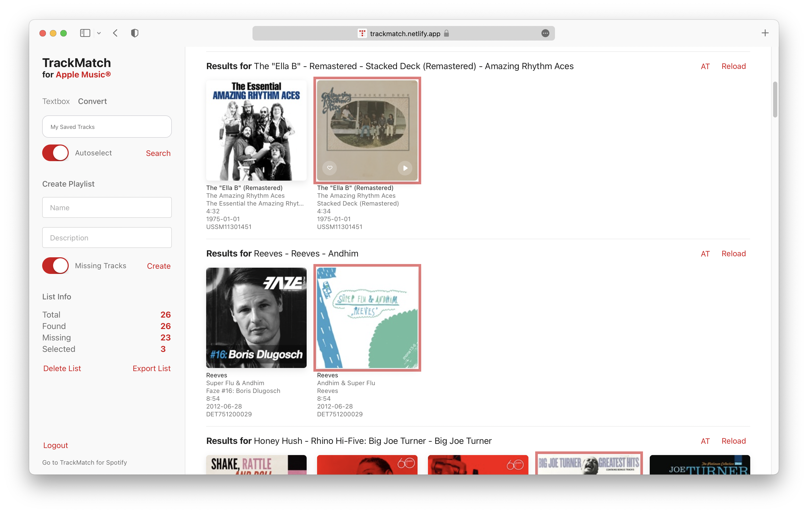
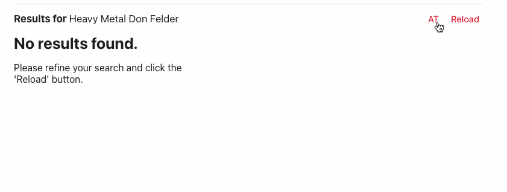

  
  

  <h3 align="center">TrackMatch</h3>

  

    A search and conversion tool for Apple Music and Spotify
     
    <a href="https://trackmatch.netlify.app/">View App</a>
    ·
    <a href="https://github.com/othneildrew/TrackMatch/issues">Report Bug</a>
    ·
    <a href="https://github.com/othneildrew/TrackMatch/issues">Request Feature</a>
  

## About

**TrackMatch** is a Web App that allows you to quickly create playlists for Spotify and Apple Music by entering a list of songs or albums or through converting playlists between the two services.

      
  

### Built With

- [React.js](https://reactjs.org/)
- [Netlify](https://netlify.com)
- [Spotify API](https://developer.spotify.com/documentation/web-api/)
- [Apple Music API](https://developer.apple.com/documentation/applemusicapi/)

## Getting Started

1. [Create an Apple Music JWT token](https://leemartin.dev/creating-an-apple-music-api-token-e0e5067e4281)
2. [Register a Spotify App](https://developer.spotify.com/dashboard/applications) and add http://localhost:8888/spotify as a Redirect URI in the app settings
3. Create an .env file in the root of the project based on .env.example
4. `npm install netlify-cli -g`
5. `netlify dev`

### Features

#### Search

If you have a text list of albums or songs copied from somewhere, enter them in the textbox, click search and start selecting. To find full albums, toggle the album switch and start selecting. When creating a playlist, the tracks of the albums will be inserted in the order of the lines of input.[^1]

#### Convert

If you’re logged in to both Spotify and Apple Music, a tab named “Convert” will appear next to the “Textbox” tab. This allows you to select a playlist from each other service. The search will take the particular recording (see “ISRC”) into account.

#### Autoselect

While in “Convert” mode, the Autoselect toggle reorders the items in each shelf according to the search string it parsed from the item in the playlist and selects the first one. This is useful in those instances where the top result will be a compilation album instead of the original release. In the sidebar, stats are displayed keeping you up to date about the number of selections you made and the number of results found.

#### Reloading

If no results show up, you can reload a shelf by editing the _Results for_ field and clicking reload.

<figure>
  
  <figcaption>Refine your search</figcaption>
</figure>

#### Change Countries

If that still doesn't help, you can always switch the country - if just out of curiosity.

<figure>
  
  <figcaption>Check whether it's your country's fault</figcaption>
</figure>

#### Automatically Add Missing Tracks

For the songs that have not been found (or where you chose to select none of the results), there’s an option called “Missing Tracks Playlist”. If activated, a playlist with the name `${NewPlaylistName} Missing Tracks` will be created in the source service, keeping track of your progress.

#### Export

Export the list as a CSV, including the search term and, if selected, the ID of the tracks.

## History

I was faced with the task of quickly converting my Apple Music collection to Spotify. Since I was making extensive use of the iCloud Music Library, this was easier said than done, as there were loads of tracks that lacked the metadata necessary to make conversion easy.

Though Apple Music is capable of matching a song in your local library to one in their catalog, the matching process relies solely on the music file itself, meaning it only cares about the _recording_, which is in turn associated with an [ISRC code](https://en.wikipedia.org/wiki/International_Standard_Recording_Code). This is problematic because the release itself might differ (think compilation albums, soundtracks, etc.).

To be exact, the following metadata is available over their API for uploaded or matched songs in your library:

- Title
- Artist Name
- Album Name
- Album Art
- Genres
- Disc Number
- Track Number
- Duration
- Whether or not the song has lyrics (added by the user)
- Catalog Number (if matched)

This is substantially less than what is available via a query to one of the songs in their catalog, which includes things like comments, composer name, release year, etc. The full list of attributes can be found [here](https://developer.apple.com/documentation/applemusicapi/songs/attributes).

(Interestingly, if you delete a fully tagged song in your library, just to re-download it seconds later, the downloaded file _does_ contain some of the original metadata, albeit not completely. This data does not seem to be available via an API, though.)

As you can see, your own tags aren't available via the API. All that is possible is to query the associated catalog number.

While they do a good job at disguising the problem by uploading your own album art (as well as the most basic metadata contained in your file, such as artist, title, album name, etc.), the problem can be exposed even simpler by creating a sharable link to a playlist with the "Matched" tracks opening it in an incognito window. A high percentage of those will reveal that the linked track has a different catalog track, most obviously by showing a very different album cover. This could be expected, but would not be necessary if they took the additional data contained in the files into account during the matching process.

Obviously, for listening purposes, having a different release is fine. For curating a collection, though, it's disastrous. It leaves us with problem of having a different song _release_ in your library. I thus decided to return back to using Spotify as my streaming service, since the added value of having your library everywhere was quite diminished at this point. It stops being _your_ library. That said, I'll still be using Apple's Music.app for managing my local collection.

Now I was left with a problem: I still wanted be able to share my playlists, but with the correct metadata. In other words, I wanted to get my local collection into Spotify, with the playlists I made on Apple Music.

To solve this conundrum, I could have taken the route of either utilizing the ITLibraryFramework integrated into MacOS and fetch the data of the local tracks from there, or go with any old tagging software and export a file with the track information. However, I quickly had to scrape this idea since I never tagged most of my files with the correct ISRC. I would have liked to use [MusicBrainz Picard](https://picard.musicbrainz.org/) for this job, but turned out that its database often misses said identifier.

But then I figured that during the matching process, the correct ISRC is assigned to each track, available over their API. This doesn't apply to uploaded tracks of course, but since Apple's algorithm is quite good, those song amount to only a relatively small part of my collection.[^2] Besides, I had to find a way to oversee the conversion process anyway, due to the problem of finding the correct release.

Since I had already been familiar with a web app called [Spotlistr](https://www.spotlistr.com), its [textbox search](https://www.spotlistr.com/search/textbox) immediately came to my mind and I wanted to built something similar with added capabilities that I missed when using it.

And so, I decided to went for two modes: A Conversion mode, which searches Spotify by ISRC of the associated track available on Apple Music and then reorders the results based on the similarity to the edited metadata provided by Apple Music, and a textbox mode, which doesn't promise to find only the same _recordings_, but you'd have to figure them out anyway (if you lacked the foresight of tagging either ISRC or UPC codes, like myself).

Furthermore, I wanted to be able to refine a search without having to reload the entire list and to have the ISRC of each song displayed next to it, to make sure it’s the recording in question and to see whether there were actual different recordings listed. A preview button would also help.

The last pickle I had with Spotlistr was its tendency to crash when creating the final playlist, which could get very frustrating. Thus, I wanted any list — including the selections made — to be saved whenever the user quit.

### Differences between the APIs

Since I worked extensively with both APIs in this project, I’ll let you in to some pros and cos of each. Right off the bat, the biggest pro for Spotify's API is that it's free. Meanwhile, using the AM API requires you to take part in the Apple Developer Program, setting you back 100$ per year.

- Apple Music has genres for each track, while Spotify has not. However, Spotify has genres for each artist, which are as colorful as they are fitting.
- Apple Music has the higher quality album art, while Spotify’s is often just an upscaled version of of the one AM uses (as can be seen in cases where their best source is under 640px\*640px). That being said, using AM’s API for the purpose of scraping artwork isn’t the best approach either — even within Apple’s own ecosystem, the iTunes API offers the highest resolution art and is thus preferable.
- AM has more easily accessible composer and label fields. Spotify does provide this info, however, not per their web API. Instead, it goes something like this: `https://spclient.wg.spotify.com/track-credits-view/v0/experimental/${track_id}/credits`
- The structure of Spotify’s API response is much nicer to read and the requests themselves can be customized more easily.
- Using Apple Music’s ISRC search returns sometimes items that aren’t available anymore (with no other storefronts working either). To get around this issue, one has to first make a request to get the country equivalent, which appears to be exactly the same but has a working link.
- Apple Music’s documentation sucks. Spotify’s is very developer-friendly with an integrated web console.
- Apple Music allows you to get the associated UPC of the album of a song all in one query, which is a big plus. Spotify meanwhile needs an extra request. This is the main reason why my implementation of the autoselect mode relies on string similiarity of the most basic attributes, instead of the more accurate UPC/ISRC combination that I used in [Strync](https://github.com/jlnbxn/strync)
- AM has the huge advantage of noting the release date of any song once queried, instead of just for an album, which can come in very handy when querying compilations.
- The playlist description field of an Apple Music playlist can have at least 2500 lines, though it doesn't show it in in the Desktop app. In the browser, up to 5000 lines get shown. The hard limit for characters meanwhile appears to be around 250000.
- Apple Music cannot delete or manipulate playlists in any way, which is a bummer. Spotify can even move the index of a song around in a playlist.
- Most of the time, Spotify gets the right/original release of a song right. That is, it's displayed as the top result doing a search.
- Overall, AM's metadata seems to be slightly more accurate, while Spotify has more original releases.

## License

Distributed under the MIT License. See `LICENSE.txt` for more information.

(<a href="#top">back to top</a>)

## Acknowledgments

- [Spotlistr](https://www.spotlistr.com)
- [Lee Martin's Guide to creating a JWT Token](https://leemartin.dev/creating-an-apple-music-api-token-e0e5067e4281)

(<a href="#top">back to top</a>)

[^1]: Users of Apple Music should take notice that if you already have the item in your iCloud music library (with a status of ‘matched’), creating a playlist with the track will _not_ honor your choice of release, i.e., Apple Music will identify the track as a duplicate and merge it with the one in your library.
[^2]: In many cases, song get uploaded when the equivalent song on Apple Music is an iTunes Digital Master, which will differ from the audio file of other streaming services.
