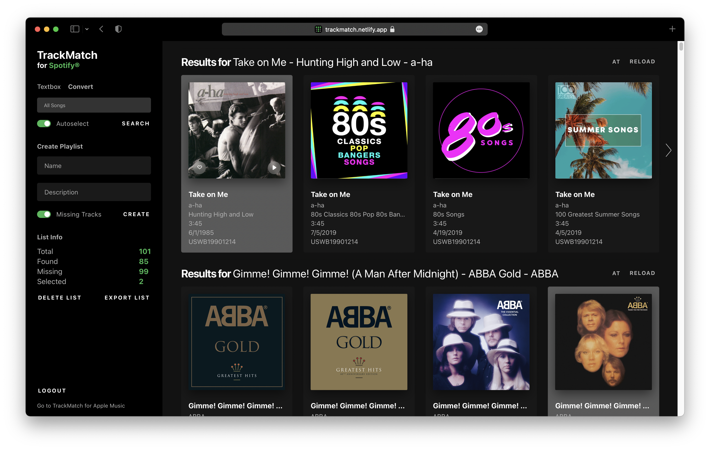

  
  

  <h3 align="center">TrackMatch</h3>

  

    A search and conversion tool for Apple Music and Spotify
     
    <a href="https://trackmatch.netlify.app/">View App</a>
    ·
    <a href="https://github.com/othneildrew/TrackMatch/issues">Report Bug</a>
    ·
    <a href="https://github.com/othneildrew/TrackMatch/issues">Request Feature</a>
  

## About

**TrackMatch** is a Web App that allows you to quickly create playlists for Spotify and Apple Music by entering a list of songs or albums or through converting playlists between the two services.

For more info, read the [blog post](https://julianboxan.com/trackmatch).

      
  

### Built With

- [React.js](https://reactjs.org/)
- [Netlify](https://netlify.com)
- [Spotify API](https://developer.spotify.com/documentation/web-api/)
- [Apple Music API](https://developer.apple.com/documentation/applemusicapi/)

## Getting Started

1. [Create an Apple Music JWT token](https://leemartin.dev/creating-an-apple-music-api-token-e0e5067e4281)
2. [Register a Spotify App](https://developer.spotify.com/dashboard/applications) and add http://localhost:8888/spotify as a Redirect URI in the app settings
3. Create an .env file in the root of the project based on .env.example
4. `npm install netlify-cli -g`
5. `netlify dev`

## License

Distributed under the MIT License. See `LICENSE.txt` for more information.

(<a href="#top">back to top</a>)

## Acknowledgments

- [Spotlistr](https://www.spotlistr.com)
- [Lee Martin's Guide to creating a JWT Token](https://leemartin.dev/creating-an-apple-music-api-token-e0e5067e4281)

(<a href="#top">back to top</a>)

